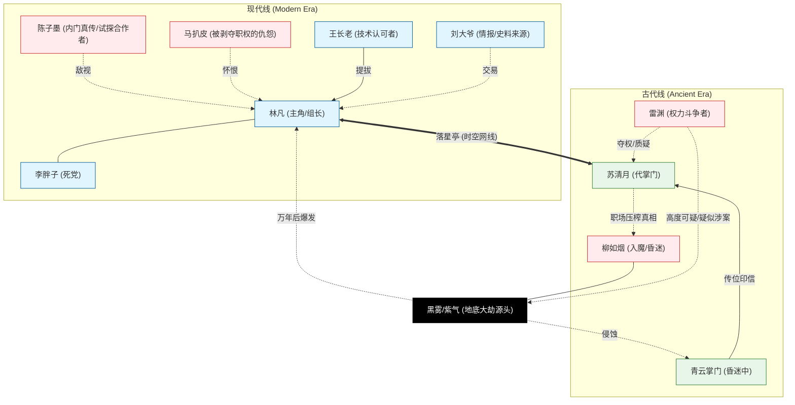

# 角色归档与状态追踪 (Character Archive & Status Tracker)

## 势力关系导图 (Relationship Diagram)

---

| 角色 | 身份 | 当前状态 | 最近动向/状态更新 | 归属线 |
| :--- | :--- | :--- | :--- | :--- |
| **林凡 (Lin Fan)** | 外门阵法修理三组组长 / 高阶阵法师 | 绷紧/急迫 | 确认第二响点偏向西南旧卸料道后，又在食堂灵汤污染中判断脏气已开始沿日常用水路外渗。 | 现代 |
| **苏清月 (Su Qingyue)** | 青云代掌门 | 负伤/硬撑权位 | 带伤去紫霄殿压场时发现掌门印只能镇秩序、镇不住被污染逼疯的人；同时从柳如烟谵语中确认其早年可能接触过灵泉边差事。 | 古代 |
| **雷渊 (Lei Yuan)** | 执法堂二长老 | 阴沉/高度可疑 | 仍与苏清月围绕掌门权与旧卷调查对峙，尚未被实锤，但已是内鬼链条最前排嫌疑人。 | 古代 |
| **李胖子 (Li Pangzi)** | 外门弟子 / 林凡帮手 | 紧张/被迫成长 | 开始跟着林凡学着听响、跑腿、打探旧道与后勤风声，仍是最稳的外门助力。 | 现代 |
| **柳如烟 (Liu Ruyan)** | 曾经的入魔师妹 | 昏迷/梦魇加深 | 除了旧日黑话外，开始反复说出“灵泉边”“补口”“井边有牙”等梦话，疑似早年就接触过污染源。 | 古代 |
| **陈子墨 (Chen Zimo)** | 内门真传 / 主峰事务参与者 | 怀疑加深/开始暗查 | 在接连几次污染事故后正式翻查林凡旧档，并把怀疑焦点落到落星亭与其异常变化的起点上。 | 现代 |
| **马扒皮 (Ma Bapi)** | 罢免的主管 | 愤恨/失势 | 因林凡的晋升而失去职位，对其怀有深刻恨意。 | 现代 |
| **王长老 (Elder Wang)** | 内门考核官 | 赞赏 | 极度看好林凡的“地脉寻龙”古法思路。 | 现代 |
| **刘大爷 (Liu Daye)** | 藏书阁老人 | 随性/警觉 | 继续替林凡提供旧案与史料便利，是当前最重要的现代线活档案来源之一。 | 现代 |
| **青云掌门 (Ancient)** | 正统化神大能 | 昏迷 | 为了抵挡黑煞反噬受重伤，导致苏清月提前上台。 | 古代 |

---

## 核心角色详述 (Detailed Profiles)

### 1. 林凡 (Lin Fan)
- **年龄**：17岁
- **性格**：抗拒卷王，推崇摸鱼哲学，但在技术细节上极度严谨。
- **金手指**：传音古阵（落星亭），连接万年前。
- **最新评价**：他要的不只是一张饭卡，而是整个局势的掌控权。

### 2. 苏清月 (Su Qingyue)
- **年龄**：16岁
- **性格**：从清冷孤傲向杀伐果断转变，逐渐习得现代权谋智慧。
- **最新评价**：开始接受必须抢时间、甚至提前埋匣的现实。

### 3. 李胖子 (Li Pangzi)
- **性格**：消息灵通的乐天派，林凡的头号拥趸。

### 4. 柳如烟 (Liu Ruyan)
- **状态提示**：大Boss的早期容器或信徒（待收束）。
