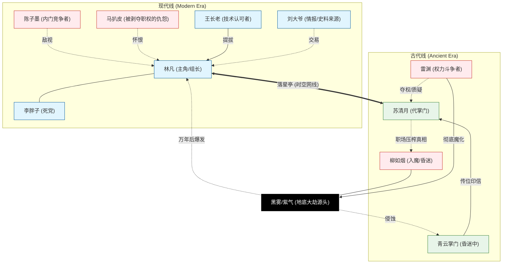

# 角色归档与状态追踪 (Character Archive & Status Tracker)

## 势力关系导图 (Relationship Diagram)

---

| 角色 | 身份 | 当前状态 | 最近动向/状态更新 | 归属线 |
| :--- | :--- | :--- | :--- | :--- |
| **林凡 (Lin Fan)** | 外门阵法修理组长 | 脱力/欣慰 | 成功执行“跨时空排污”计划，彻底清除了现代外门据点的黑雾威胁，目前陷入昏迷。 | 现代 |
| **苏清月 (Su Qingyue)** | 青云代掌门 | 虚弱/胜利 | 协助林凡完成排污，亲手导引业火清除雷渊及禁地紫雾，威望达到巅峰。 | 古代 |
| **雷渊 (Lei Yuan)** | 执法堂二长老 | **已战死 (Incinerated)** | 在引导紫雾冲击主峰时，被从一万年后逆流而来的业火正面吞噬，形神俱灭。 | 古代 |
| **李胖子 (Li Pangzi)** | 灵草园管理/三组副手 | 惊魂未定 | 在黑雾爆发中死里逃生，对林凡的“黑科技”感到既畏惧又依赖。 | 现代 |
| **柳如烟 (Liu Ruyan)** | 曾经的入魔师妹 | 昏迷/魔化后遗症 | 神识受损，常在睡梦中提及“编制、分红”等黑话。 | 古代 |
| **陈子墨 (Chen Zimo)** | 内门真传/阵法司长 | 怀疑/窥视 | 察觉到林凡技术的异常精密，怀疑其身怀古代秘宝或传承，开始暗中调查其背景。 | 现代 |
| **马扒皮 (Ma Bapi)** | 罢免的主管 | 愤恨/失势 | 因林凡的晋升而失去职位，对其怀有深刻恨意。 | 现代 |
| **王长老 (Elder Wang)** | 内门考核官 | 赞赏 | 极度看好林凡的“地脉寻龙”古法思路。 | 现代 |
| **刘大爷 (Liu Daye)** | 藏书阁老人 | 随性 | 被林凡的贡献点和市侩手段“收买”，为其提供史料便利。 | 现代 |
| **青云掌门 (Ancient)** | 正统化神大能 | 昏迷 | 为了抵挡黑煞反噬受重伤，导致苏清月提前上台。 | 古代 |

---

## 核心角色详述 (Detailed Profiles)

### 1. 林凡 (Lin Fan)
- **年龄**：17岁
- **性格**：抗拒卷王，推崇摸鱼哲学，但在技术细节上极度严谨。
- **金手指**：传音古阵（落星亭），连接万年前。
- **最新评价**：他要的不只是一张饭卡，而是整个局势的掌控权。

### 2. 苏清月 (Su Qingyue)
- **年龄**：16岁
- **性格**：从清冷孤傲向杀伐果断转变，逐渐习得现代权谋智慧。
- **最新评价**：开始意识到，“时代变了”。

### 3. 李胖子 (Li Pangzi)
- **性格**：消息灵通的乐天派，林凡的头号拥趸。

### 4. 柳如烟 (Liu Ruyan)
- **状态提示**：大Boss的早期容器或信徒（待收束）。
